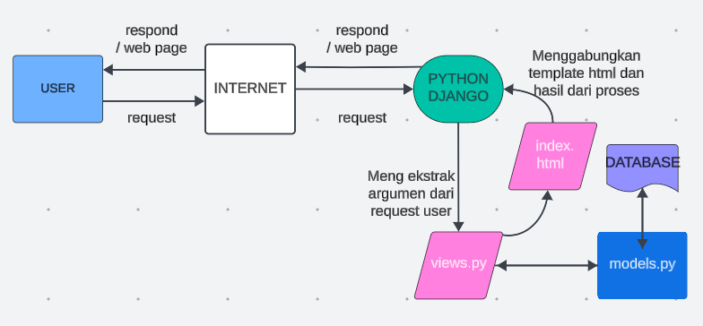

# LODON MART 
Nama : Simforianus Jonathan Flonas Harefa
NPM : 2306217430
Kelas : PBP E

Tautan menuju PWS yang sudah di deploy :
[lodon mart link](http://simforianus-jonathan-lodonmart.pbp.cs.ui.ac.id/)

Step by step membuat proyek django :
1. membuat direktori lokal bernama "lodon_mart" (sesuai nama e-commerce saya)
2. Membuat dan mengaktifkan virtual environment dengan tujuan mengisolasi package serta dependencies dari aplikasi agar tidak bertabrakan dengan versi lain yang ada pada komputer
3. Membuat dokumen txt yang berisi list of dependencies (komponen / modul seperti library, framework, atau package yang berguna untuk mempercepat pengembangan dan developer / pengembang memanfaatkan kode yang sudah ada) yang dibutuhkan untuk membuat proyek django.
4. Melakukan instalasi terhadap depedencies yang ada di dalam dokumen txt (diberi nama requirements.txt) di dalam terminal dengan command 'pip install -r requirements.txt'
5. Membuat proyek django untuk e-commerce saya dengan instruksi 'django-admin startproject lodon_mart .'
6. Membuka file settings.py pada bagian direktori proyek 'lodon_mart' dan menambahkan 2 string' "localhost", "127.0.0.1" ' pada list bernama Allowed_Hosts untuk memungkinkan local host untuk mengakses proyek ini (dalam kondisi ini hanya bisa diakses dari jaringan pribadi saya).
7. Menjalankan server django dengan menjalankan program pada manage.py dengan instruksi 'python manage.py runserver'. Untuk menghentikan server pencet CTRL + C dan ketik 'deactivate' untuk keluar dari virtual environment.

Step by step membuat aplikasi main pada proyek 'lodon_mart' :
1. Membuat aplikasi baru dengan nama 'main' dengan instruksi 'python manage.py startapp main'. Akan tercipta direktori baru yang berisi struktur awal untuk aplikasi django lodon_mart.
2. Mendaftarkan aplikasi main ke dalam proyek 'lodon_mart' dengan menambahkan string 'main' pada list Installed_Apps pada file settings.py di dalam direktori proyek lodon_mart.

Step by step membuat fungsi pada views.py untuk dikembaklikan ke template html :
1. Membuat terlebih dahulu direktori baru bernama 'template' di dalam direktori 'main' lalu membuat file html yang berisikan format untuk menampilkan nama, kelas, dan npm.
2. Pada bagian views.py (mengimport render dari modul django.shortcuts), membuat fungsi baru(contoh nama : show_main) dengan parameter request. Lalu buatlah dictionary (contoh nama : context) di dalamnya dengan key masing-masing adalah nama,kelas,dan npm dengan value yang bersesuaian.
3. Buatlah agar fungsi show_main tersebut mereturn fungsi render dengan parameter(request, nama file html, dictionary berisi informasi nama, kelas, dan npm yang akan diteruskan ke tampilan untuk penampilan dinamis).
4. Setelah ini kita bisa dapat mengganti konten bagian nama, kelas, dan npm pada bagian file html dengan nama variabel di dalam '{{}}'
(Hal ini adalah tujuan dari render di file views.py agar dapat me render informasi value dalam dictionary konteks yang akan ditampilkan pada file html sesuai dengan nama key dari dictionary tersebut).

Step by step membuat sebuah routing pada urls.py aplikasi main untuk memetakan fungsi yang telah dibuat pada views.py :
1. pada file urls.py di direktori main, import path dari modul django.urls
2. Import fungsi show_main dari main.views.
3. Inisialisasi variabel untuk menyimpan nama aplikasi yaitu 'main'.
4. Membuat list dengan isi path('', show_main, name ='show_main').

keterangan :

path(...) -> Mendefiniskan pola url
'' -> Pola URL yang diberikan adalah string kosong, yang berarti ini adalah root atau home URL dari aplikasi
show_main -> fungsi pada views.py yang dipanggil saat url ini diakses
name = 'show-main' -> nama yang diberikan kepada pola url yang didefinisikan ini

Step by step melakukan routing untuk menjalankan aplikasi 'main' :
1. Membuka urls.py yang ada di direktori proyek 'lodon_mart' (bukan direktori main).
2. import path,include dari modul django.urls.
3. Menambahkan dalam list url_patterns ( yang awalnya hanya berisi path('admin/', admin.site.urls) ) dengan path('', include('main.urls')).

keterangan :

path(...) -> mendefinisikan pola url
'' -> diarahkan ke rute yang didefinisikan dalam berkas urls.py aplikasi main (dibuat string kosong agar halaman aplikasi main dapat langsung diakses).
include('main.urls') -> memasukkan pola url dari modul lain (di sini adalah urls.py dari direktori aplikasi 'main').

Step by step membuat model pada aplikasi main dengan nama Product dan memiliki atribut 'name', 'price', dan 'description' :
1. Membuka models.py dalam direktori aplikasi 'main'.
2. Membuat class baru bernama Product dengan parameter models.Model.
3. Menambahkan atribut name dengan tipe charField, price dengan tipe IntegerField, dan description dengan tipe TextField
4. Menambahkan properti berisi fungsi "_str_(self)" untuk menampilkan nama dan harga dari product (opsional).

Step by step deployment ke PWS terhadap aplikasi yang sudah dibuat :
1. Login akun PWS (dengan syarat sudah registrasi terlebih dahulu).
2. Menekan tombol 'Creat New Project '.
3. Mengisi nama poject dengan 'lodonmart'.
4. Menyimpan informasi credential untuk username dan password.
5. Membuka settings.py di direktori proyek 'lodon_mart' dan menambahkan url deployment pada list Allowed_Hosts menjadi 
ALLOWED_HOSTS = ["localhost", "127.0.0.1", "http://simforianus-jonathan-lodonmart.pbp.cs.ui.ac.id/"]
6. Menyimpan perubahan pada repository github dengan melakukan add,commit,dan push.
7. Menjalankan instruksi yang ada di bagian project command di PWS.
8. Buka proyek lodonmart lewat akses sidebar dan menunggu status yang awalnya Building menjadi Running.
9. URL deployment dapat diakses.

# Bagan yang berisi request client ke web aplikasi berbasis Django beserta responnya

Penjelasan : 
1. User mengirimkan request melalui browser ke server
2. Internet menghubungkan pengguna dengan server aplikasi. request diteruskan via internet ke server yang menjalankan django.
3. Python Django sebagai framework yan digunakan sebagai pengelola utama aplikasi. django menerima request user dan diteruskan ke urls.py
4. Urls.py berisi kode untuk mendefinisikan url. urls.py mencari url yang cocok untuk diteruskan ke logic di views.py
4. views.py merupakan file berisi fungsi untuk menangani logika bisnis dan berinteraksi dengan data base lewat models.py
5. models.py berisi model yang didefinisikan developer yang digunakan untuk mengambil data yang diperlukan dari database lalu dilakukan perhitungan dan manipulasi data yang diperlukan untuk respons kembali dan akan dilakukan rendering kembali yang dipanggil di file views.py.
6. Template html seabagai interface / tampilan yang dilihat user (html,css, js). django akan me render template html dengan menggabung data yang dihasilkan sebagai respond dan dikembalikan oleh aplikasi melalui internet kembali kepada user. respond berupa perubahan pada halaman halaman html tergantung request yang diberikan oleh user pada awal kesempatan.

# GIT RELATED
Git merupakan suatu perangkat lunak pengendali versi atau proyek manajemen kode perangkat lunak.

Fungsi Git dalam pengembangan perangkat lunak :

1. Control Version
Kontrol versi merupakan salah satu fungsi utama dari git, yaitu sebuah sistem untuk mengatur pengelolaan perubahan pada source code atau dari dokumen-dokumen lainnya (sinkronisasi perubahan pada source code).

Tujuannya :
1a. Tracking terhadap perubahan source code dari waktu ke waktu untuk tujuan pemantauan. Hal tersebut juga didukung oleh fitur pada git yang dapat melakukan tagging / labeling pada tahap tertentu dalam riwayat revisi kode.

1b. Recover / Rollback kode ke versi sebelum diupdate atau direvisi (jika update yang baru kurang sesuai dan preferensi lebih menuju ke arah source code sebelum dilakukan perubahan).

2. Branching dan Merging
2a. Branching yang memungkinkan para developer untuk dapat membuat cabang baru yang dapat digunakan untuk perbaikan bug pada kode atau melakukan improvement lainnya pada kode yang nantinya bisa kembali di merging ke branch utama.

2b. Merging kode dari beberapa developer dan dapat disimpan di branch yang berebeda

2c. Git yang dapat membantu untuk meresolusi konflik saat terjadinya merging antara beberapa developer

2d. Forking / mendapatkan salinan terhadap kode proyek yang dapat dimodifikasi untuk kepentingan developer dan bisa mengajukan perubahan tersebut (melalui pull request).

3. Kolaborasi 
Hal paling lainnya adalah kolaborasi. Lewat git sebagai proyek manajemen kode ini, para developer bisa mengerjakan suatu proyek secara simultan / bersamaan dengan melakukan branching, merging, forking, maupun resolusi konflik seperti yang sudah dijelaskan untuk mempermudah pekerjaan. Hal tersebut dapat meningkatkan efisiensi dalam berkerja .

4. Security
Git dapat memebrikan kita untuk memilih  orang orang tertentu (developer) yang ingin diberikan izin untuk diberikan kontrol akses terhadap source code pada repositori yang ada serta akses untuk melakukan perubahan terhadap kode tersebut.

# DJANGO FOR STARTING POINT
Alasan mengapa framework django menjadi opsi sebagai awal untuk mempelajari pengembangan perangkat lunak :

1. Dokumentasi 
Dokumentasi django dibuat dengan lengkap dan rinci mulai dari tutorial terhadap penggunaan django dan tahapan untuk membuat project pertama dengan django, guides untuk topik,konsep,dan latar belakang informasi mengenai django, guide terhadap referensi teknikal untuk API dan aspek lain mesin django, dan lainnya.

2. Fitur 
Fitur bawaan django yang ditawarkan oleh django lumayan lengkap seperti admin interface seperti sistem templating untuk aplikasi dan proyek yang cukup lengkap, autentikasi pengguna, dan juga ORM (Object-Relational Mapping) yang akan dijelaskan nanti.

3. Python Language
Sebagai salah satu mahasiswa Fasilkom UI yang sempat belajar DDP1 di semester 1 lalu. Saya merasa dimudahkan dalam penggunaan framework django yang menggunakan dasar bahasa pemrograman python. Di samping pengalaman saya dalam mempelajari python, menurut saya untuk para pemula yang baru belajar, bahasa pemrograman python merupakan salah satu bahasa pemrograman yang mudah dipahami, sehingga cukup mudah untuk mempelajari penggunaaan dan menggunakan framework django untuk memulai pembelajaran terhadap pengembangan perangkat lunak.

4. Security
Fitur keamanan django yang dibuat untuk mengantisipasi serangan seperti Cross-Site Scripting (memasukkan kode html ke suatu website seakan akan merupakan suatu kode bawaan dari website tersebut yang dapat menyebabkan kerusakan situs / pencurian info pribadi), Cross-Site Request Forgery (pemalsuan permintaan izin akses dari suatu website yang biasanya untuk pencurian info pribadi), dan SQL Injection (memanfaatkan celah keamanan untuk mengakses data dari database yang tidak diberikan akses).

# Django and ORM 
 ORM sendiri adalah teknik pemrograman untuk menggunakan database relasional untuk menyimpan data dalam bentuk objek. Bahas pemrograman yang digunakan harus support OOP untuk dapat menggunakan database relasional sebagai penyimpanan.

model django disebut ORM (Object-Relational Mapping).
Hal tersebut dapat dikatakan dengan alasan dengan definisi suatu class dan instansiasi objek lewat bahas pemrograman python dapat digunakan untuk berinteraksi dengan database tanpa harus melakukan query secara terpisah untuk berinteraksi database.

