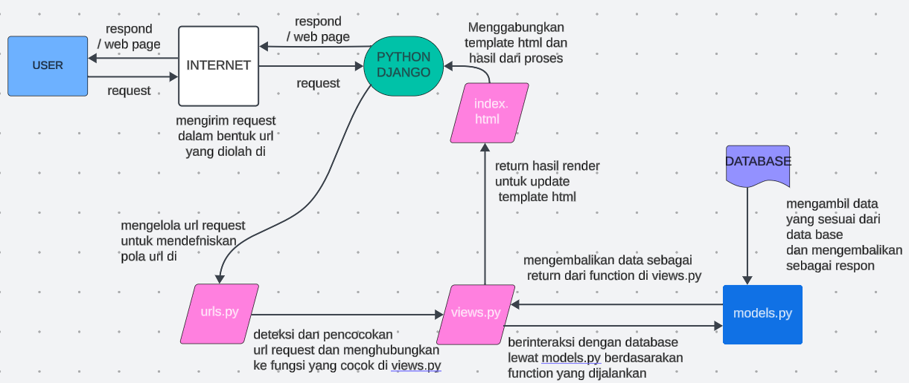

# LODON MART 
---
Tautan menuju PWS yang sudah di deploy :
[lodon mart link](http://simforianus-jonathan-lodonmart.pbp.cs.ui.ac.id/)
---

## TUGAS 1
### Step By Step
Step by step membuat proyek django :
1. membuat direktori lokal bernama "lodon_mart" (sesuai nama e-commerce saya)
2. Membuat dan mengaktifkan virtual environment dengan tujuan mengisolasi package serta dependencies dari aplikasi agar tidak bertabrakan dengan versi lain yang ada pada komputer
3. Membuat dokumen txt yang berisi list of dependencies (komponen / modul seperti library, framework, atau package yang berguna untuk mempercepat pengembangan dan developer / pengembang memanfaatkan kode yang sudah ada) yang dibutuhkan untuk membuat proyek django.
4. Melakukan instalasi terhadap depedencies yang ada di dalam dokumen txt (diberi nama requirements.txt) di dalam terminal dengan command 'pip install -r requirements.txt'
5. Membuat proyek django untuk e-commerce saya dengan instruksi 'django-admin startproject lodon_mart .'
6. Membuka file settings.py pada bagian direktori proyek 'lodon_mart' dan menambahkan 2 string' "localhost", "127.0.0.1" ' pada list bernama Allowed_Hosts untuk memungkinkan local host untuk mengakses proyek ini (dalam kondisi ini hanya bisa diakses dari jaringan pribadi saya).
7. Menjalankan server django dengan menjalankan program pada manage.py dengan instruksi 'python manage.py runserver'. Untuk menghentikan server pencet CTRL + C dan ketik 'deactivate' untuk keluar dari virtual environment.

Step by step membuat aplikasi main pada proyek 'lodon_mart' :
1. Membuat aplikasi baru dengan nama 'main' dengan instruksi 'python manage.py startapp main'. Akan tercipta direktori baru yang berisi struktur awal untuk aplikasi django lodon_mart.
2. Mendaftarkan aplikasi main ke dalam proyek 'lodon_mart' dengan menambahkan string 'main' pada list Installed_Apps pada file settings.py di dalam direktori proyek lodon_mart.

Step by step membuat fungsi pada views.py untuk dikembaklikan ke template html :
1. Membuat terlebih dahulu direktori baru bernama 'template' di dalam direktori 'main' lalu membuat file html yang berisikan format untuk menampilkan nama, kelas, dan npm.
2. Pada bagian views.py (mengimport render dari modul django.shortcuts), membuat fungsi baru(contoh nama : show_main) dengan parameter request. Lalu buatlah dictionary (contoh nama : context) di dalamnya dengan key masing-masing adalah nama,kelas,dan npm dengan value yang bersesuaian.
3. Buatlah agar fungsi show_main tersebut mereturn fungsi render dengan parameter(request, nama file html, dictionary berisi informasi nama, kelas, dan npm yang akan diteruskan ke tampilan untuk penampilan dinamis).
4. Setelah ini kita bisa dapat mengganti konten bagian nama, kelas, dan npm pada bagian file html dengan nama variabel di dalam '{{}}'
(Hal ini adalah tujuan dari render di file views.py agar dapat me render informasi value dalam dictionary konteks yang akan ditampilkan pada file html sesuai dengan nama key dari dictionary tersebut).

Step by step membuat sebuah routing pada urls.py aplikasi main untuk memetakan fungsi yang telah dibuat pada views.py :
1. pada file urls.py di direktori main, import path dari modul django.urls
2. Import fungsi show_main dari main.views.
3. Inisialisasi variabel untuk menyimpan nama aplikasi yaitu 'main'.
4. Membuat list dengan isi path('', show_main, name ='show_main').

keterangan :

path(...) -> Mendefiniskan pola url
'' -> Pola URL yang diberikan adalah string kosong, yang berarti ini adalah root atau home URL dari aplikasi
show_main -> fungsi pada views.py yang dipanggil saat url ini diakses
name = 'show-main' -> nama yang diberikan kepada pola url yang didefinisikan ini

Step by step melakukan routing untuk menjalankan aplikasi 'main' :
1. Membuka urls.py yang ada di direktori proyek 'lodon_mart' (bukan direktori main).
2. import path,include dari modul django.urls.
3. Menambahkan dalam list url_patterns ( yang awalnya hanya berisi path('admin/', admin.site.urls) ) dengan path('', include('main.urls')).

keterangan :

path(...) -> mendefinisikan pola url
'' -> diarahkan ke rute yang didefinisikan dalam berkas urls.py aplikasi main (dibuat string kosong agar halaman aplikasi main dapat langsung diakses).
include('main.urls') -> memasukkan pola url dari modul lain (di sini adalah urls.py dari direktori aplikasi 'main').

Step by step membuat model pada aplikasi main dengan nama Product dan memiliki atribut 'name', 'price', dan 'description' :
1. Membuka models.py dalam direktori aplikasi 'main'.
2. Membuat class baru bernama Product dengan parameter models.Model.
3. Menambahkan atribut name dengan tipe charField, price dengan tipe IntegerField, dan description dengan tipe TextField
4. Menambahkan properti berisi fungsi "_str_(self)" untuk menampilkan nama dan harga dari product (opsional).

Step by step deployment ke PWS terhadap aplikasi yang sudah dibuat :
1. Login akun PWS (dengan syarat sudah registrasi terlebih dahulu).
2. Menekan tombol 'Creat New Project '.
3. Mengisi nama poject dengan 'lodonmart'.
4. Menyimpan informasi credential untuk username dan password.
5. Membuka settings.py di direktori proyek 'lodon_mart' dan menambahkan url deployment pada list Allowed_Hosts menjadi 
ALLOWED_HOSTS = ["localhost", "127.0.0.1", "http://simforianus-jonathan-lodonmart.pbp.cs.ui.ac.id/"]
6. Menyimpan perubahan pada repository github dengan melakukan add,commit,dan push.
7. Menjalankan instruksi yang ada di bagian project command di PWS.
8. Buka proyek lodonmart lewat akses sidebar dan menunggu status yang awalnya Building menjadi Running.
9. URL deployment dapat diakses.

### Bagan yang berisi request client ke web aplikasi berbasis Django beserta responnya


Penjelasan : 
1. User mengirimkan request melalui browser ke server
2. Internet menghubungkan pengguna dengan server aplikasi. request diteruskan via internet ke server yang menjalankan django.
3. Python Django sebagai framework yan digunakan sebagai pengelola utama aplikasi. django menerima request user dan diteruskan ke urls.py
4. Urls.py berisi kode untuk mendefinisikan url. urls.py mencari url yang cocok untuk diteruskan ke logic di views.py
4. views.py merupakan file berisi fungsi untuk menangani logika bisnis dan berinteraksi dengan data base lewat models.py
5. models.py berisi model yang didefinisikan developer yang digunakan untuk mengambil data yang diperlukan dari database lalu dilakukan perhitungan dan manipulasi data yang diperlukan untuk respons kembali dan akan dilakukan rendering kembali yang dipanggil di file views.py.
6. Template html seabagai interface / tampilan yang dilihat user (html,css, js). django akan me render template html dengan menggabung data yang dihasilkan sebagai respond dan dikembalikan oleh aplikasi melalui internet kembali kepada user. respond berupa perubahan pada halaman halaman html tergantung request yang diberikan oleh user pada awal kesempatan.

### GIT RELATED
Git merupakan suatu perangkat lunak pengendali versi atau proyek manajemen kode perangkat lunak.

Fungsi Git dalam pengembangan perangkat lunak :

1. Control Version
Kontrol versi merupakan salah satu fungsi utama dari git, yaitu sebuah sistem untuk mengatur pengelolaan perubahan pada source code atau dari dokumen-dokumen lainnya (sinkronisasi perubahan pada source code).

Tujuannya :
1a. Tracking terhadap perubahan source code dari waktu ke waktu untuk tujuan pemantauan. Hal tersebut juga didukung oleh fitur pada git yang dapat melakukan tagging / labeling pada tahap tertentu dalam riwayat revisi kode.

1b. Recover / Rollback kode ke versi sebelum diupdate atau direvisi (jika update yang baru kurang sesuai dan preferensi lebih menuju ke arah source code sebelum dilakukan perubahan).


2. Branching dan Merging
2a. Branching yang memungkinkan para developer untuk dapat membuat cabang baru yang dapat digunakan untuk perbaikan bug pada kode atau melakukan improvement lainnya pada kode yang nantinya bisa kembali di merging ke branch utama.

2b. Merging kode dari beberapa developer dan dapat disimpan di branch yang berebeda

2c. Git yang dapat membantu untuk meresolusi konflik saat terjadinya merging antara beberapa developer

2d. Forking / mendapatkan salinan terhadap kode proyek yang dapat dimodifikasi untuk kepentingan developer dan bisa mengajukan perubahan tersebut (melalui pull request).

3. Kolaborasi 
Hal paling lainnya adalah kolaborasi. Lewat git sebagai proyek manajemen kode ini, para developer bisa mengerjakan suatu proyek secara simultan / bersamaan dengan melakukan branching, merging, forking, maupun resolusi konflik seperti yang sudah dijelaskan untuk mempermudah pekerjaan. Hal tersebut dapat meningkatkan efisiensi dalam berkerja .

4. Security
Git dapat memebrikan kita untuk memilih  orang orang tertentu (developer) yang ingin diberikan izin untuk diberikan kontrol akses terhadap source code pada repositori yang ada serta akses untuk melakukan perubahan terhadap kode tersebut.

### DJANGO FOR STARTING POINT
Alasan mengapa framework django menjadi opsi sebagai awal untuk mempelajari pengembangan perangkat lunak :

1. Dokumentasi 
Dokumentasi django dibuat dengan lengkap dan rinci mulai dari tutorial terhadap penggunaan django dan tahapan untuk membuat project pertama dengan django, guides untuk topik,konsep,dan latar belakang informasi mengenai django, guide terhadap referensi teknikal untuk API dan aspek lain mesin django, dan lainnya.

2. Fitur 
Fitur bawaan django yang ditawarkan oleh django lumayan lengkap seperti admin interface seperti sistem templating untuk aplikasi dan proyek yang cukup lengkap, autentikasi pengguna, dan juga ORM (Object-Relational Mapping) yang akan dijelaskan nanti.

3. Python Language
Sebagai salah satu mahasiswa Fasilkom UI yang sempat belajar DDP1 di semester 1 lalu. Saya merasa dimudahkan dalam penggunaan framework django yang menggunakan dasar bahasa pemrograman python. Di samping pengalaman saya dalam mempelajari python, menurut saya untuk para pemula yang baru belajar, bahasa pemrograman python merupakan salah satu bahasa pemrograman yang mudah dipahami, sehingga cukup mudah untuk mempelajari penggunaaan dan menggunakan framework django untuk memulai pembelajaran terhadap pengembangan perangkat lunak.

4. Security
Fitur keamanan django yang dibuat untuk mengantisipasi serangan seperti Cross-Site Scripting (memasukkan kode html ke suatu website seakan akan merupakan suatu kode bawaan dari website tersebut yang dapat menyebabkan kerusakan situs / pencurian info pribadi), Cross-Site Request Forgery (pemalsuan permintaan izin akses dari suatu website yang biasanya untuk pencurian info pribadi), dan SQL Injection (memanfaatkan celah keamanan untuk mengakses data dari database yang tidak diberikan akses).

#### Django and ORM 
 ORM sendiri adalah teknik pemrograman untuk menggunakan database relasional untuk menyimpan data dalam bentuk objek. Bahas pemrograman yang digunakan harus support OOP untuk dapat menggunakan database relasional sebagai penyimpanan.

model django disebut ORM (Object-Relational Mapping).
Hal tersebut dapat dikatakan dengan alasan dengan definisi suatu class dan instansiasi objek lewat bahas pemrograman python dapat digunakan untuk berinteraksi dengan database tanpa harus melakukan query secara terpisah untuk berinteraksi database.

---
## TUGAS 2

### Step by Step 
Disclaimer :
Sebelumnya telah dibuat file untuk template html, yaitu "base.html" yang berfungsi sebagai template dasar yang dapat digunakan sebagai kerangka umum untuk halaman web lainnya di dalam proyek dan juga "main.html" untuk menampilkan halaman utama saat memasuki website proyek lodon mart.

Step by Step Membuat input form untuk menambahkan objek model pada app sebelumnya :
1. Membuat berkas baru bernama forms.py pada direktori aplikasi main.
2. Pada bagian awal kode, import ModelForm dari modul django.forms dan import class Product dari main.models
3. Membuat class baru bernama "ProductForm" dan buatlah class lagi di dalamnya bernama "Meta".
4. Di dalam class meta, definisikan 
"model = Product"
Kode tersebut menunjukkan model untuk form di mana data dari pengisian form aku disimpan dalam bentuk objek class 'Product' yang diimport dari models.py di direktori aplikasi main saat ini.
5. tambahkan baris "fields = ["name", "price", "description"]" sebagai field dari model "Product" yang digunakan untuk form.
6. Di bagian berkas views.py, tambahkan import baru untuk redirect dari modul django.shortcuts
7. membuat fungsi baru bernama create_product dengan isi
"""
form = ProductForm(request.POST or None)

    if form.is_valid() and request.method == "POST":
        form.save()
        return redirect('main:show_main')

    context = {'form': form}
    return render(request, "create_product.html", context)
"""
baris pertama digunakan untuk membuat entry ProductForm baru dengan memasukkan QueryDict berdasarkan input dari user pada request.POST.

baris "IF" berguna untuk menyimpan data hasil dari input form jika telah divalidasi dan jika dilakukan post request oleh user. Setelah itu dilakukan redirecting ke fungsi show_main pada views aplikasi main setelah data form berhasil disimpan.

Buatlah agar fungsi create_product tersebut mereturn fungsi render dengan parameter(request, nama file html (di sini sudah disediakan file html template bernama create_product.html), dictionary berisi tulisan form sebagai key dan value nya yang akan diteruskan ke tampilan untuk penampilan dinamis).

8. Membuka berkas urls.py di direktori aplikasi main lalu menambahkan fungsi create_product yang diimport dari main.views.
9. Menambahkan pola url untuk diproses daat request di minta pada list urlpatterns yaitu 
" path('create-product', create_product, name='create_product') ".

keterangan :
path(...) -> Mendefiniskan pola url
'create-product' -> Pola URL yang akan ditangani adalah /create-product.
create_product -> fungsi pada views.py yang dipanggil saat url ini diakses
name = 'create_product' -> nama yang diberikan kepada pola url yang didefinisikan ini. Pemberian nama ini berguna untuk membuat referensi URL secara dinamis di template atau di bagian lain dari aplikasi Django

11. Membuat berkas html baru di direktori template dengan nama "create_product.html" sesuai dengan nama berkas html yang diletakan dalam parameter fungsi sebagai lokasi untuk di render dalam fungsi buatan create_product di berkas views.py direktori aplikasi main.
12. create_product.html ini dibuat dengan melakukan extend dari base.html sebagai template dasar website dengan isi block content tag form dengan atribut method = POST, lalu template tags untuk crsf token yang berfungsi sebagai security, lalu tag table berisi template tag  {{ form.as_table }} yang digunakan untuk menampilkan fields form yang sudah dibuat pada forms.py sebagai table dan di dalamnya tambahkan tag <input type="submit" value="Add Product"/> digunakan sebagai tombol submit untuk mengirimkan request ke view create_product(request).
13. Pada berkas main.html sebaga halaman utama, menambahkan tag tautan link dengan atribut href untuk mendefinisikan alamat link berupa template tag django dengan isi url app_name:path_name yang telah didefinisikan di urls.py (pada direktori aplikasi main dan untuk menjalankan fungsi create_product) dan menambahkan tag button sebegai event yang harus dilakukan untuk redirecting ke halaman baru untuk mengisi form data produk baru.

Potongan kode :
<a href="">
  <button>Add New Product</button>
</a>

14. Pada fungsi show_main yang sebelumnya sudah kita buat untuk menampilkan tampilan utama berupa nama, kelas, dan npm, kita tambahkan baris baru pada awal fungsi "products = Product.objects.all()" yang digunakan untuk mengambil seluruh objek Product yang tersimpan pada database. Lalu menambahkan data baru dalam dictionary dengan key dan value yaitu "products". (Opsional dilakukan untuk menampilkan data-data hasil entry yang sudah ada di database setelah form diisi dan valid).

Step by Step membuat  4 fungsi views baru untuk melihat objek yang sudah ditambahkan dalam format XML, JSON, XML by ID, dan JSON by ID.
1.  Membuka berkas views.py pada direktori aplikasi main
2.  Mengimport HttpResponse dari modul django.http dan import  serializers dari modul django.core
3. Tambahkan beberapa kode di bawah :
"""
def show_xml(request):
    data = Product.objects.all()
    return HttpResponse(serializers.serialize("xml", data), content_type="application/xml")

def show_json(request):
    data = Product.objects.all()
    return HttpResponse(serializers.serialize("json", data), content_type="application/json")

def show_xml_by_id(request, id):
    data = Product.objects.filter(pk=id)
    return HttpResponse(serializers.serialize("xml", data), content_type="application/xml")


def show_json_by_id(request, id):
    data = Product.objects.filter(pk=id)
    return HttpResponse(serializers.serialize("json", data), content_type="application/json")
"""
keterangan :

- baris "data = Product.objects.all()" digunakan untuk mengambil seluruh objek Product yang tersimpan pada database

- baris "data = Product.objects.filter(pk=id)" digunakan mendapatkan semua objek Product dari database di mana primary key (pk) objek tersebut sama dengan nilai atribut id pada class Product yang telah di modelkan di direktori aplikasi main di berkas models.py

- baris "return HttpResponse(serializers.serialize("...", data), content_type="application/...")" digunakan untuk mengirimkan respons HTTP kepada client dengan parameter yang menyimpan data hasil query yang telah di translasi  objek model menjadi format lain seperti (dalam fungsi yang ada berupa XML / JSON) oleh fungsi serialize dari objek serializers dan juga parameter content_type yaitu header HTTP menentukan tipeMIME dari respons agar client dapat mengetahui format data yang dikrimkan (dalam fungsi yang ada yaitu JSON atau XML).

fungsi :
- show_xml = mengembalikan data dalam bentuk xml
- show_json = mengembalikan data dalam bentuk json
- show_xml_by_id = mengembalikan data dalam bentuk xml sesuai atribut id pada class Product yang telah digenerate menggunakan modul uuid
- show_json_by_id = mengembalikan data dalam bentuk json esuai atribut id pada class Product yang telah digenerate menggunakan modul uuid

Step by step membuat routing URL untuk masing-masing views yang telah ditambahkan :
1. Membuka berkas urls.py pada direktori aplikasi main.
2. Mengimport fungsi yang sudah dibuat, yaitu show_xml,show_json,show_json_by_id,show_xml_by_id dari main.views.
3. Menambahkan path baru dalam list urlpatterns untuk masing masing fungsi yang telah dibuat.

Potongan kode :
path('xml/', show_xml, name='show_xml'),
path('json/', show_json, name='show_json'),
path('xml/<str:id>/', show_xml_by_id, name='show_xml_by_id'),
path('json/<str:id>/', show_json_by_id, name='show_json_by_id')

keterangan :
path(...) -> Mendefiniskan pola url
'...' -> Pola URL yang akan ditangani adalah "xml/" atau "json/" atau "xml/id" atau "json/id".
"show_...." -> fungsi pada views.py yang dipanggil saat url ini diakses
name = 'show_...' -> nama yang diberikan kepada pola url yang didefinisikan ini. Pemberian nama ini berguna untuk membuat referensi URL secara dinamis di template atau di bagian lain dari aplikasi Django

### Pentingnya Data Delivery dalam Implementasi Platform

1. Integritas Sistem dan Sinkronisasi data
Data delivery dalam suatu platform yang melibatkan banyak pengguna dan sistem dapat menjaga sinkronisasi antara data pusat dengan data yang ditampilkan dapat diakses melalui platform tersebut. Jadi dapat menghindari terjadinya misinformasi dan dapat memberikan update informasi secara real time kepada pengguna.
Data delivery juga membantu dalam integrasi sistem. Hal tersebut dapat dilihat dari berbagai jenis sumber data yang digunakan oleh platform modern yang digabungkan mulai dari database internal maupun API eksternal. Data delivery memungkinan pengaksesan data-data tersebut dan dapat diproses di satu tempat / wadah.

2. Pengalaman Pengguna
Pengiriman data yang cepat dan konsisten dapat meningkatkan kepuasan dalam pengalaman pengguna di platform tersebut. Selain itu karena pengiriman data biasa dilakukan juga untuk fitur interaktif untuk para pengguna seperti notifikasi chat atau notifikasi untuk pembaharuan. Pengalaman pengguna yang mulus dan cepat sangat bergantung pada pengiriman data yang cepat dan andal.

3. Analisis Data dan Laporan
Dengan sistem data delivery yang dapat membantu sinkronisasi data pada data pusat dan platforn serta integrasi data dari berbagai sumber yang berbeda di dalam satu tempat (data warehouse / data lake) dapat memungkinkan ketersediaan data yang uptodate agara dapat dilakukan analisis yang komprehensif ynag tentunya digunakan untuk pengembangan sistem yang lebih baik atau melakukan penambahan fitur. Selain itu, data delivery juga  memastikan data yang digunakan untuk membuat laporan selalu up-to-date dan akurat.

4. Migrasi Data
Data delivery dapat digunakan untuk melakukan pemindahan data dari sistem lama ke sistem yang baru. Hal tersebut biasanya dilakukan oleh suatu perusahaan yang ingin melakukan perpindahan menuju platform yang baru dengan tujuan untuk meningkatkan efektivitas dan efisiensi dalam bekerja atau melakukan perubahan dalam sistem dan dalam menjalankan platform yang telah dibuat.

### XML dan JSON

Berikut beberapa alasan mengapa JSON lebih populer penggunaannya dibanding XML :

1. Syntax JSON dan XML
Syantax milik JSON lebih ringkas dan simple dibandingkan XML. Hal itu dapat menentukan kenyamanan bagi para developer untuk cenderung memilih JSON dibadndaingkan dengan XML. JSON menggunakan tanda kurung kurawal {} untuk objek dan tanda kurung siku [] untuk array, yang membuatnya lebih mudah dibaca dan ditulis daripada XML, yang menggunakan tag pembuka dan penutup.

2. JavaScript
JSON adalah format yang asli untuk JavaScript, sehingga pengelolaan dan proses manipulasi lebih mudah apabila digunakan dalam aplikasi web yang berbasis JavaScript. Selain itu JS memiliki beberapa built in function yang dikhususkan untuk mengakses JSON, sehingga lebih sederhana dan efisien dalam pengerjaannya (contoh : JSON.parse() dan JSON.stringify()).

3. Readability
Karena Syntax dari JSON yang lebih ringkas dan tidak diperlukan tag tag untuk menulis informasinya / datanya membuat JSON terlihat lebih mudah untuk dibaca bagi manusia dan dimengerti dibandingkan dengan XML yang walaupun terlihat lebih terstruktur, masih memberikan kesan yang kurang rapih dan lebih kompleks dibandingkan JSON.

4. Ukuran File
Ukuran File JSON lebih kecil dibandingkan dengan XML karena syntax yang sederhana. Sedangkan XML mengambil memori yang lebih besar karena ukuran file nya yang lebih besar pula dilihat dari syntaxnya yang memerlukan beberapa tag untuk informasi yang ada dan belum termasuk atribut (info mendetail) yang merupakan bawaan dari tag nya. Hal tersebut memungkinkan JSON untuk dapat mengurangi penggunaan bandwidth dan waktu pemrosesan saat mentransfer data melalui jaringan.

5. Fleksibilitas
JSON memberikan para developer kemudahan dan fleksibiltas dalam mengelola dan pengembangan data karena datanya lebih dinamis dan tentunya mudah untuk diubah. Dibandingkan dengan JSON, XML terlihat lebih kaku karena harus mengikuti skema yang ketat seperti XSD (XML Scheme Definition).

Sebagai seorang programmer, kita tidak bisa menyimpulkan mengenai bahasa pemrograman terbaik, framework terbaik, platform terbaik, dan lainnya. Semua bahasa pemrograman, framework, maupun sistem data delivery dibangun dengan spesifikasi yang berbeda-beda, serta memiliki kekurangan dan kelebihan masing-masing. Pemakaian sistem data delivery pada suatu platform disesuaikan dengan kebutuhan perusahaan atau kebutuhan pengembang terhadap aplikasi tersebut. Apabila kita ingin memiliki format data yang lebih ringkas(lebih mudah dibaca dan diterjemahkan) dan lebih mudah untuk diproses (efektifitas transmisi data), dan khsususnya jika mengembangkan suatuplatform berbasis javascript.. JSON merupakan pilihan yang lebih baik dan memudahkan dibandingkan XML. Namun, jika anda membutuhkan struktur data yang sangat terperinci dengan dukungan untuk validasi dan metadata tambahan, memerlukan dukungan untuk namespace yang kompleks, dan jika tuntutan dari terdapat pekerjaan di mana skema validasi atau markup dokumen penting... anda dapat memilih untuk menggunakan XML. Jadi tidak ada yang lebih baik antara satu sama lain, namun mana yang lebih cocok pengunaannya bagi para developer yang dapat memudahkan pekerjaan mereka. (pendapat pribadi saya).

### Fungsi Method is_valid() pada Form Django

Ketika pengguna mengirimkan data melalui formulir, metode is_valid() akan memeriksa apakah data yang dimasukkan memenuhi semua persyaratan validasi yang telah ditetapkan. Validasi tersebut ditentukan berdasarkan dari kelas "form". Selain itu, method ini juga mencakup validasi built-in Django (seperti validasi email atau angka) dan juga validasi lain yang telah developer tambahkan. Method ini akan me return suatu tipe data boolean. Jika valid akan return "true" dan jika tidak akan return "false". Jika kita memanggil method is_valid() maka Django secara otomatis memanggil metode clean() pada form dan pada setiap field form = clean_<fieldname>().

Method ini dibutuhkan untuk :
1. Keamanan Data yang terjamin karena sebelum data dimasukkan de dalam database, data tersebut diproses lewat method is_valid() ini sehingga dapat membantu untuk menjaga integritas data dan mencegah inkonsistensi data atau data yang tidak valid. Hal tersebut dapat mencegah serangan siber seperti SQL Injection atau XSS(Cross Site Scripting).
2. Responsif terhadap pengguna / client karena jika data yang diberikan tidak valid, akan muncul suatu error berbentuk notifikasi / pemberitahuan dan dapat membantu pengguna untuk mengirim data selanjutnya dengan benar.

### CSRF Token Pada Django

CSRF (Cross-Site Request Forgery) adalah serangan siber dimana attacker mengirimkan request ke sebuah aplikasi web dengan mengatasnamakan akun user yang telah terautentikasi dan tentunya tidak diketahui oleh user asli dan tanpa persetujuan terlebih dahulu. CSRF yang disediakan oleh Django dibuat dengan tujuan untuk mencegah terjadinya serangan CSRF pada aplikasi web kita. CSRF token memastikan bahwa permintaan yang dikirim ke server berasal dari sumber yang sah dan bukan dari penyerang. Token ini berupa string unik yang dikirim oleh server ke browser pengguna dan dikirim kembali dengan setiap permintaan untuk mengolah data. Dengan begini para attacker akan kesusahan karena akan kesulitan untuk mencoba mengakses karena tidak memiliki token user yang valid.

Jika tidak mengaplikasian csrf token ini. Maka attacker dapat lebih mudah untuk melakukan pengaksesan tanpa seizin user yang valid dan dapat melakukan berbagai hal seperti membuat form palsu yang bisa jadi berisi permintaan yang berbahaya untuk situs kita. Serta dapat mengubah pengaturan akun maupun sistem yang ada seperti mengubah password pengguna atau menghapus akun pengguna serta dapat membuat form palsu untuk melakukan transaksi keuangan maupun pembelian terhadap suatu barang / jasa, dan juga dengan membuat banyak permintaan yang tidak sah, yang bisa menyebabkan kerusakan sistem atau beban berlebih pada server.

Cara mereka memanfatkan kesempatan tersebut bisa dengan pembuatan halaman web yang berisi script yang mengirimkan request ke aplikasi target tanpa sepengetahuan pengguna(biasanya menggunakan iframe tersembunyi). Dengan cara seperti itu, Jika pengguna yang terautentikasi mengunjungi halaman berbahaya yang telah dibuat oleh penyerang, permintaan yang dikirim dari halaman tersebut dapat menggunakan kredensial pengguna untuk melakukan suatu tindakan tanpa diektahui oleh pengguna tersebut.

### Screenshoot Postman
JSON

XML

JSON by ID

XML by ID


## TUGAS 3

### Step by step implementasi fungsi registrasi
1. Buka views.py di direktori aplikasi main (nama aplikasi = main).
2. import UserCreationForm sebagai formulir bawaan dari django untuk formulir pendaftaran user dalam aplikasi web dari modul django.contrib.auth serta import messages dari modul django.contrib untuk menampilkan pesan pada halaman web jika berhasil melakukan pendaftaran atau gagal.
3. Menambahkan fungsi baru dalam views.py untuk menghasiilkan formulir registrasi yang secara otomatis membuat akun baru untuk user saat form di submit. Lakukan validasi isi data untuk disumbit menjadi akun baru pengguna dan melakukan redirecting ke halaman utama atau kembali ke halaman login diikuti dengan me-render template html untuk halaman web yang sekarang sedang diakses.
4. Membuat halaman html untuk melakukan registrasi yang akan dilihat oleh user (jika belum ada) dan di dalam tag form menambahkan method = "Post" lalu diikuti dengan kode block {{ form.as_table }} yang menyambungkan dengan fungsi register di views.py.
5. Lalu buka urls.py dan import fungsi regiseter dari views.py (main.views).
6. Memabahkan fungsi path dengan potongan kode :
```python
    urlpatterns = [
     ...
     path('register/', register, name='register'),
 ]
```
keterangan :
- "register/" = nama url
- register = fungsi di views.py untuk melakukan register
- name ="register" = nama yang diberikan kepada pola url yang didefinisikan.

### Step by step implementasi fungsi login
1. Buka views.py di direktori aplikasi main (nama aplikasi = main).
2. Melakukan import AuthenticationForm dari modul django.contrib.auth.forms untuk formulir login user dalam aplikasi web dan import authenticate dan juga login dari modul django.contrib.auth.
3. Lalu buat fungsi untuk melakukan login pada akun yang sudah teregistrasi. Lakukan validasi isi data untuk disumbit untuk login ke akun baru pengguna dan fungsi  "login(request, user)" berfungsi untuk melakukan login terlebih dahulu. Jika pengguna valid, fungsi ini akan membuat session untuk pengguna yang berhasil login. Setelah itu melakukan redirecting ke halaman yang sesuai tergantung hasil autentikasi terhadap user yang login untuk penentuan hak akses diikuti dengan me-render template html untuk halaman web yang sekarang sedang diakses.
4. Membuat halaman html untuk melakukan login yang akan dilihat oleh user (jika belum ada) dan di dalam tag form menambahkan method = "Post" diikuti dengan kode block {{ form.as_table }} yang menyambungkan dengan fungsi login di views.py.
5. Lalu buka urls.py dan import fungsi login dari views.py (main.views).
6. Memabahkan fungsi path dengan potongan kode :
```python
    urlpatterns = [
     ...
     path('login/', login_user, name='login'),

 ]
```
keterangan :
- "login/" = nama url
- login_user = fungsi di views.py untuk melakukan login
- name ="login" = nama yang diberikan kepada pola url yang didefinisikan.

### Step by step implementasi fungsi logout
1. Buka views.py di direktori aplikasi main (nama aplikasi = main).
2. Melakukan import logout dari modul django.contrib.auth untuk menggunakan fungsi logout bawaan framework django.
3. Lalu buat fungsi untuk melakukan logout pada akun yang sudah teregistrasi. Menggunakan fungsi  "logout(request)" berfungsi untuk melakukan logout terlebih dahulu. Setelah itu melakukan redirecting url untuk halaman login.
4. menambahkan button seperti contoh di bawah di bagian halaman html utama agar di halaman web terdapat tombol bagi user untuk melakukan logout :
```python
a href="">
  <button>Logout</button>
</a>
```
5. Lalu buka urls.py dan import fungsi logout dari views.py (main.views).
6. Memabahkan fungsi path dengan potongan kode :
```python
    urlpatterns = [
     ...
     path('logout/', logout_user, name='logout'),

 ]
```
keterangan :
- "logout/" = nama url.
- logout_user = fungsi di views.py untuk melakukan logout.
- name ="logout" = nama yang diberikan kepada pola url yang didefinisikan.

### Step by Step membuat dua akun pengguna dengan masing-masing tiga dummy data 

#### Lewat LocalHost 
1. Membuka terminal dan masuk ke dalam direktori proyek utama.
2. Masuk ke dalam virtual environment.
3. Menjalankan command untuk runserver yaitu :
```
python manage.py runserver
```
4.  membuka link "http://localhost:8000/" untuk mengakses halaman web kita.
5.  buka halaman "register now"
6. Masukkan username dan password unik yang sama sebanyak 2 kali untuk membuat akun user pertama.
7. Jika kembalik ke halaman login, login dengan data username dan paswword user pertama yang telah dibuat.
8. Isi form untuk membuat product_entry.
9. Masukkan informasi mengenai field field yang diminta oleh product sesuai model yang telah didefinisikan di models.py di direktori aplikasi. setelah itu sumbit form untuk membuat product tersebut.
10. Setelah itu, lakukan langkah 9 sebanyak 3 kali untuk membuat 3 produk. 
11. Logout dari akun user sekarang.
12. Lalu ikuti lagi tahap 5 s.d. 10 untuk mendapatkan 2 user dengan masing masing 3 dummy data product. 

#### Lewat berkas python
1. Membuat file python(contoh nama = create_user_and_data.py) dalam direktori aplikasi untuk tempat membuat 2 user baru dengan masing-masing 3 dummy data 
2. Import 'Basecommand' dari modul django.core.management.base dan import 'user' dari django.contrib.auth.models dan import 'Product' dari main.models(nama aplikasi = main, dan dokumen model = models.py).
3. Buat class baru lalu buat fungsi di dalamnya untuk menghandle instansiasi user dan data yang dimiliki user dengan contoh :
```python
class Command(BaseCommand):
    def handle(self, *args, **kwargs):
```
4. Buat user dengan di dalam fungsi di atas beserta username dan passwordnya :
```python
user1 = User.objects.create_user(username='user1', password='password1')
user2 = User.objects.create_user(username='user2', password='password2')
```
5. Buat dummy data sebanyak 3 kali sesuai dengan fiel yang sudah didefiniskan di models.py direktori aplikasi :
```python
for i in range(0, 3):
    # Jika ingin membuat data mengenai field tiap user yang unik dan tidak berpola, tidak perlu menggunakan for loop dan lakukan sebanyak 3 kali untuk masing-masing user.
    Product.objects.create(
        user=user1,
        name=f"produk lodon user1 ke {i}",
        price=100 * (i+1), # harga produk 1,2,3 = 100, 200, 300
        description=f'Inilah produk ke {i} dari user1'
    )
    Product.objects.create(
        user=user2,
        name=f"produk lodon user2 ke {i}",
        price=200 * (i+1),  # harga produk 1,2,3 = 200, 400, 600
        description=f'Inilah produk ke {i} dari user2'
    )
```
6. Buka termminal lalu masuk ke direktori utama proyek django dan masuk ke dalam viertual environment. 
7. Jalankan command 
```
python manage.py create_user_and_data
```
8. (tahap opsional) Pastikan bahwa data user dan dummy data sudah bertambah dengan mengakses database dbsqlite3 menggunakan terminal dengan perintah :
```
python manage.py shell
```

### Step by Step penghubungan Model Product dengan User
Penghubungan model product dan user dalam penggunaan framework django berguna untuk mengalokasikan produk sesuai dengan user yang membuatnya. 
1. Buka models.py yang ada di direktori aplikasi
2. Dimulai dengan memastikan bahwa model Product sudah didefinisikan terlebih dahulu.
3. Jika sudah ada model Product, kita bisa meng-import User dari modul django.contrib.auth.models
4. Di dalam model product, definisikan atribut user dengan syntax :

```python
user = models.ForeignKey(User, on_delete=models.CASCADE)
```

penjelasan :
- ForeignKey = relasi yang bersifat "one to many" yang makdusnya adalah stau user memiliki banyak product
- on_delete=models.CASCADE = karena user dan produk terhubung, jika user dihapus, produk yang terhubung dengannya akan terhapus juga dalam database.

5. Buka views.py pada direktori aplikasi kita
6. Pada fungsi yang didefiniskan untuk membuat product baru dan menggunakan form dan method submit post untuk mendapatkan informasinya.. berikut contoh potongan kode :

```python
# instansiasi model tapi belum disimpan di database
product_entry = form.save(commit=False)

# melakukan deklarasi user yang sedang login ke field 'user' dari objek model
product_entry.user = request.user

# menyimpan objek produk dengan data atributnya di dalam database
product_entry.save()
```

7. Pada fungsi yang didefinikan untuk menampilkannya pada template html, definisikan variabel untuk menyimpan produk yang hanya dimiliki user dan ditambahkan ke dalam dictionary bernama "context" untuk dirender, contoh potongan kode :

```python
products = <nama model produk>.objects.filter(user=request.user)

context = {
...
"products" = products,
...
}
```

8. Buka terminal pada directory proyek utama (direktori tempat adanya direktori aplikasi).
9. Masuk ke virtual environment
10. Melakukan migration pada "manage.py" dengan kode:

```python
python manage.py makemigrations
python manage.py migrate
```

penjelasan : jika anda ingin menetapkan nilai default untuk field "user", sebelum makemigrations harus membuat satu user terlebih dahulu.

hal ini dilakukan untuk  membuat file migrasi berdasarkan perubahan yang telah dilakukan pada models.py aplikasi dan menerapkan migrasi yang telah dibuat ke basis data.

### Step by step dan menerapkan cookies seperti last login pada halaman utama aplikasi
1. Pastikan bahwa telah melakukan logout user sebelum menjalankan tahap di bawah ini.
2. Pada views.py di direktori aplikasi, import HttpResponseRedirect dari modul django.http dan import reverse dari django.urls.
3. Pada bagian validasi data form login di fungsi login, ganti dengan kode :

```python
### fetch user dari database berdasarkan data yang disubmit di form login
user = form.get_user()

# melakukan login user
login(request, user)

# membuat response berupa redirecting ke halaman untuk user setelah login
response = HttpResponseRedirect(reverse("main:show_main"))

# membuat cookie last_login untuk ditambahkan ke dalam respons
response.set_cookie('last_login', str(datetime.datetime.now()))
return response
```

4. Pada fungsi untuk menampilkan halaman setelah login, kita dapat menampilkan data login terakhir dari fungsi login yang sebelumnya telah kita update dengan menambahkan data berupa :

```python
# context adalah dictionary berisi data data yang akan di render dalam fungsi ini ke halaman html utama untuk user setelah login

context = {
...
last_login': request.COOKIES['last_login'],
...
}
```

5. Pada bagian fungsi untuk logout, ubah kode menjadi :
```python
# contoh nama fungsi untuk logout
def logout_user(request):
    # melakukan logout dari user yang sedang login
    logout(request)

    # membuat response berupa redirecting ke halaman login untuk user setelah logout
    response = HttpResponseRedirect(reverse('main:login'))

    # menghapus cookie data waktu login terakhir
    response.delete_cookie('last_login')
    return response
```

6. Pada halaman html setelah login user, tambahkan baris tag paragraf atau header (opsional) untuk menampilkan data terkahir login menggunakan template variabel yang telah didefinisikan di fungsi login views.py direktori aplikasi.
Contoh :
```html
...
<h5>Sesi terakhir login: {{ last_login }}</h5>
...
```

7. Melakukan command runserver di terminal untuk mengupdate perubahan (jika belum dinyalakan).

### Step by step menampilkan detail informasi pengguna yang sedang logged in seperti username 
1. Buka views.py yang ada di direktori aplikasi.
2. Pada bagian fungsi untuk menampilkan halaman utama setelah login, tambahkan informasi yang diinginkan(contoh = username dan product yang dimilikinya) :
```python
mood_entries = MoodEntry.objects.filter(user=request.user)
# contoh fungsi untuk menampilkan halaman utama setelah login user
def show_main(request):

    # definisikan variabel products yang menyimpan data model 'Product' yang telah dibuat di models.py dan difilter sesuai kepemilikan user (pastikan anda sudah menghubungkan model dengan user)
    products = Product.objects.filter(user=request.user)

    # dictionary berisi data untuk di render di berkas html jika request user untuk login berhasil.
    context = {
         'name': request.user.username,
         'products' = products,
         ...
    }
    ...
```

### Perbedaan antara HttpResponseRedirect() dan redirect()

HttpResponseRedirect adalah kelas yang berasal dari modul django.http yang akan mengembalikan respons pengalihan HTTP (link url baru) dengan kode status 302 (Found) dengan tujuan mengarahkan user / client ke url tertentu. 
Munculnya kode 302 ini disebabkan oleh pemeliharaan atau update situs web, konten khusus wilayah tertentu /specific region, alpha test / beta test, dan lainnya.
Parameter yang digunakan untuk HttpResponseRedirect adalah nama url asli yang dingin dituju. Hal ini berguna jika kita perlu mengalihkan ke URL statis atau melakukan logika pengalihan yang lebih kompleks.

Redirect() adalah fungsi yang disediakan oleh django tepatnya dari modul django.shortcuts untuk melakukan pengalihan url agar lebih mudah dan fleksibel. Parameter untuk fungsi redirect ini sendiri pun dapat berupa string dari nama url atau nama view yang akan dikonversi oleh django menjadi url, dan objek model / instance.

Perbedaan utama antara HttpResponseRedirect() dan redirect() terletak pada: parameter yang diterima dengan HttpResponseRedirect menggunakan url yang spesifik untuk pengalihan langsung dan redirect memberi fleksibilatas yang tinggi dengan parameter url / objek model / nama view-nya.

### Authentication dan Authorization
Autenthentication merupakan proses untuk memverifikasi identitas pengguna. Hal ini memastikan bahwa user yang mencoba mengakses sistem adalah benar user itu sendiri (e.g. verifikasi kebenaran username dan password saat login).

Sedangkan Authorziation adalah proses untuk menentukan apakah pengguna yang telah diautentikasi, memiliki hak akses ke resource tertentu (e.g. menentukan hak akses yang berbeda antara user biasa dan admin).

Jadi saat user login pertama dilakukan tahapan autentikasi untuk menentukan kebenaran data login agar dapat login ke user yang diinginkan. Lalu dilakukan otorisasi terhadap akun yang sedang login untuk membatasi hak akses terhadap sumber daya yang ada.

Django mengimplementasikannya dengan cara :
1. Autenthentication
- Model user pada django meyimpan informasi penting mengenai user user yang ada (e.g. username, password, dan lainnya).
- Pada views direktori aplikasi terdapat fungsi yang dibuat untuk login user dan juga fungsi untuk melakukan logout user
- Proses autentikasi dapat dilakukan dengan fungsi bawaan dari framework django dengan mengimport "authenticate" dari modul "django.contrib.auth". Dengan melakukan fetch terhadap user dan disimpan pada suatu variabel seperti contoh berikut ini :

```python
def login_user(request):
    username = request.POST['username']
    password = request.POST['password']
    user = authenticate(request, username=username, password=password)
    if user != None:
        login(request, user)
    else :
        messages.error(request, 'Invalid username or password.')
```

2. Authorization
- Kita dapat menggunakan decorator untuk mengatur izin antara admin dan user biasa dengan menggunakan django
- Kita dapat mengelompokan user berdasarkan tingkat hak akses yang dimiliki untuk memberikan izin terhadap akses-akses tertentu kepada grup user tertentu
- Django memberikan fitur middleware agar dapat memastikan bahwa fungsi view tertentu hanya bisa diakses oleh user user yang terautentikasi untuk fungsi tersebut.

### Django and Cookies

Untuk mengingat data user yang pernah login, django menggunakan session. Django memiliki framework session guna menyimpan data di server. Saat user berhasil login, Django membuat session baru,informasi dari user akan disimpan di dalam database atau memori (tergantung konfigurasi aplikasi kita). Django akan membuat cookie yang menyimpan SessionID,last login, atau csrf token(bisa disetting pada fungsi di views.py) dan akan dikirim ke browser user. Setiap ada request baru dari user, cookie dikirim ke server dan django mencari session yang sesuai dengan id yang ada untuk identifikasi pengguna. Lalu cookies yang telah dibuat akan dihapus browser setelah user logout

Fungsi lain dari cookies :
- Dapat memnyimpan settingan mengenai preferensi pengguna selama mengakses halaman web (e.g. interface settings, language settings, dan lainnya).
- Melacak aktivitas user selama ada di situs web agar dapat personalisasi terhadap konten yang diberikan maupun iklan yang ditampilkan (e.g. pada sosial media konten dan iklan yang tampil sesuai dengan konten yang sering kita liat dan sukai).
- Analisis data user pengunjung situs web, seperti ketertarikan user, durasi user di sesi teretentu untuk improvement terhadap situs web.

Keamanan Cookies :
Tidak semua cookies aman digunakan oleh user yang sedang mengakses situs web. Contohnya seperti cookies yang menyimpan informasi penting dan privacy seperti authentication token yang mungkin dapat diakses oleh javascript admin web, cookies yang disetel oleh pihak lain dalam web seperti pengiklan sehingga dapat dilakukan pelacakan user di berbagai situs web, dan juga jika user mengizinkan cookies yang tidak memiliki secure setting / Httponly yang sehingga rentan terjadinya cross site scripting (XSS).

## TUGAS 4

### Step by Step Implementasi fungsi untuk mengedit produk
1. Buka views.py pada direktori aplikasi(contoh : main).
2. Buatlah fungsi baru dengan parameter request dan juga id produk untuk mengedit field field dari objek model yang telah kita buat sebelumnya yang ada di database.
3. Definisikan produk yang ingin dimabil berdasarkan primary key / id. Lalu definiskan objek ProductForm dengan parameter request berupa post, dan instance nya produk yang telah didefiniskan sebelumnya.
4. Lakukan validasi isi form dengam method bawaan "isValid()", lalu simpan perubahan form dan membuat response berupa redirecting ke halaman untuk user setelah edit data produk.
5. Melakukan rendering ke halaman template html tempat hasil rendering setelah proses edit nilai dari data produk yang diinginkan(contoh: render ke halaman "main.html").
6. Buka urls.py di direktori aplikasi (contoh : main) dan import method untuk edit data dari main.views lalu di dalam list url yang ingin dirutekan, definisikan pola url beserta dengan fungsi edit yang bersesuaian agar dapat diproses oleh request yang diterima oleh django.
contoh :
```python
path('edit-product/<uuid:id>', edit_product, name='edit_product')
```
path(...) -> Mendefiniskan pola url
- 'edit-product/<uuid:id>' -> Pola URL yang akan ditangani adalah "edit-product/<uuid:id>" di mana tag tersebut merujuk kepada uuid dari masing masing produk yang dibuat oleh akun user yang berbeda-beda.
- "edit_product" -> fungsi pada views.py yang dipanggil saat url ini diakses
- name = 'edit_product' -> nama yang diberikan kepada pola url yang didefinisikan ini. Pemberian nama ini berguna untuk membuat referensi URL secara dinamis di template atau di bagian lain dari aplikasi Django

7.Pada template / halaman html tujuan dari fungsi dari views.py direktori aplikasi untuk menampilkan produk yang telah dibuat oleh user, tambahkan tag referensi <a> dengan atribut template block untuk url yang akan dirutekan ke fungsi di views.py dan primary key untuk masing-masing produk dan button sebagai event pemicu untuk memberikan request berupa POST (menghapus data objek produk yang dituju dari database).
contoh :
```html
<td>
    <a href="">
        <button>
            Delete Product
        </button>
    </a>
</td>
```

### Step by Step Implementasi fungsi untuk menghapus produk
1. Buka views.py pada direktori aplikasi(contoh : main).
2. Buatlah fungsi baru dengan parameter request dan juga id produk untuk menghapus objek model yang telah kita buat sebelumnya yang ada di database.
3. Definisikan produk yang ingin dimabil berdasarkan primary key / id. menghapus produk yang telah didefiniskan dengan method delete() lalu membuat response berupa redirecting ke halaman untuk user setelah menghapus data produk.
4.  Buka urls.py di direktori aplikasi (contoh : main) dan import method untuk hapus data dari main.views lalu di dalam list url yang ingin dirutekan, definisikan pola url beserta dengan fungsi hapus yang bersesuaian agar dapat diproses oleh request yang diterima oleh django.
contoh :
```python
path('delete-product/<uuid:id>', delete_product, name='delete_product')
```
path(...) -> Mendefiniskan pola url
- 'delete-product/<uuid:id>' -> Pola URL yang akan ditangani adalah "delete-product/<uuid:id>" di mana tag tersebut merujuk kepada uuid dari masing masing produk yang dibuat oleh akun user yang berbeda-beda.
- "delete" -> fungsi pada views.py yang dipanggil saat url ini diakses
- name = 'delete' -> nama yang diberikan kepada pola url yang didefinisikan ini. Pemberian nama ini berguna untuk membuat referensi URL secara dinamis di template atau di bagian lain dari aplikasi Django

5. Pada template / halaman html tujuan dari fungsi dari views.py direktori aplikasi untuk menampilkan produk yang telah dibuat oleh user, tambahkan tag referensi <a></a> dengan atribut template block untuk url yang akan dirutekan ke fungsi di views.py dan primary key untuk masing-masing produk dan button sebagai event pemicu untuk memberikan request berupa POST (mengedit field data objek produk yang dituju dari database).
contoh :
```html
<td>
    <a href="">
        <button>
            Edit product
        </button>
    </a>
</td>
```

### Step by Step kustomisasi desain pada template HTML menggunakan CSS atau CSS framework (Tailwind)
1. Pastikan kita telah menambahkan tag meta ```<meta name="viewport">``` untukk menyesuaikan ukuran perangkat mobile.
2. Menambahkan script source untuk menyambungkan template django dengan tailwind
```html
<script src="https://cdn.tailwindcss.com">
    </script>
```

#### Kustomisasi Halaman Login
1. Mengedit halaman ```login.html``` dengan Menambahkan kustomisasi dengan tag <div></div>untuk title halaman untuk login contoh tulisan "Login Account,".
2. Menambahkan kustomisasi dengan tag <div></div> input untuk username dan password dengan tipe text untuk input username dan tipe password untuk input password 
3. Menambahkan kustomisasi dengan tag <div></div> untuk tombol yang dilakukan untuk submit data untuk login user
4. Menambahkan if block dengan parameter messages (hasil dari percobaan login) dan iterasi tiap message dengan block for loop  dan berikan kondisi kustomisasi penyampaian pesan (warna,size,bentuk,dll) sesuai dengan respon (sukses,error, dan pesan default).
5. Menambah keterangan di bawah tag input untuk memilih opsi melakukan pendaftaran akun bila belum mmeiliki akun di data base dengan tag <a></a> dengan template block url yang mengarahkan ke fungsi untuk mendaftar akun baru di views.py pada direktori aplikasi (contoh :main).

#### Kustomisasi Halaman Register
1. Mengedit halaman ```register.html``` dengan Menambahkan kustomisasi dengan tag <div></div>untuk title halaman untuk login contoh tulisan "Create Account,".
2. Menambahkan block for loop untuk iterasi tiap field pada form django yang akan menampilkan label field, dan field untuk mengisi data, baik untuk username maupun password.
3. Menambahkan if block untuk memberi ikon peringatan bila ada kesalahan dalam validasi input pembuatan akun user baru, lalu akan menampilkan pesan kesalahan / error yang terjadi
4. Menambahkan kustomisasi dengan tag <div></div> berisi tag button yang memiliki tipe submit untuk melakukan registrasi akun.
5. Menambahkan if block dengan parameter messages (hasil dari percobaan registrasi) dan iterasi tiap message dengan block for loop  dan berikan kondisi kustomisasi penyampaian pesan (warna,size,bentuk,dll) sesuai dengan respon (sukses,error, dan pesan default).
6. Menambah keterangan di bawah tag input untuk memilih opsi melakukan login bila sudah mmeiliki akun di data base dengan tag <a></a> dengan template block url yang mengarahkan ke fungsi untuk login akun baru di views.py pada direktori aplikasi (contoh :main).


#### Kustomisasi Halaman Pembuatan Produk
1. Mengedit halaman ```create_product.html``` dengan Menambahkan kustomisasi dengan tag <div></div>untuk title halaman untuk login contoh tulisan "Create Product,".
2. Memnambahkan kustomisasi dengan tag <form></form> dengan method POST yang didalamnya terdapat for loop block untuk tiap field di dalam form di mana akan menampilkan label field dengan tag <label></label> dan field untuk mengisi data untuk objek model produk yang ingin dibuat.
3. Menambahkan keterangan berdasarkan hasil POST field, untuk menampilkan teks bantuan jika field tersebut menyediakan dan juga esan error apabila terdapat kesalahan saat input data untuk pembuatan produk.
4. Menambahkan kustomisasi dengan tag <div></div> berisi tag button yang memiliki tipe submit untuk melakukan pembuatan produk.

### Tahapan sebelum kustomisasi
1. Pada directory root, buatlah directori static/css.
2. Buatlah berkas css bernama "global.css".
3. Isi kustomisasi global.css sesuai keinginan.
4. Pada "base.html" di direktori root project, tambahkan baris di bawah untuk menghubungkan global.css dan script Tailwind ke base.html:
```html
...
<link rel="stylesheet" href=""/>
...
```

### Step by Step kustomisasi halaman daftar product
1. Mengedit halaman dengan Menambahkan kustomisasi dengan tag <div></div>untuk title halaman untuk menampilkan daftar produk dengan contoh dialkukan pada halaman utama ```main.html```.
2. Menambahkan kustomisasi dengan tag <div></div> yang jika kita memiliki halaman html berisi template "card" untuk menampilkan informasi secara terstruktur dan estetik,dapat kita cantumkan template block "include halaman html (contoh : ```card_info.html```)" yang mengambil 2 parameter variabel untuk judul dan isi fieldnya.
3. Menambahkan kustomisasi dengan tag <div></div> untuk menunjukkan cookies yang diinginkan seperti last login.
4. Menambahkan kustomisasi dengan tag <div></div> untuk menambahkan tag baru <a></a> dengan template block url yang diarahkan ke fungsi untuk membuat produk baru di views.py direktori aplikasi (contoh : main)
5. Menambahkan if block dengan parameter produk (mengecek ada atau tidak di dalam database [minimal 1] ), akan ditambahkan tag </img> dengan source nya berupa template block static untuk menampilkan foto yang diinginkan yang sudah kita alokasikan terlebih dahulu di direktori (contoh : ```rootProject/static/image/sedih_banget.png```) diikuti dengan tag <p></p> dengan keterangan contoh "belum ada produk".
6. Menambahkan kustomisasi dengan tag <div></div> yang berisi block for loop untuk iterasi setiap produk yang ada di database yang dimiliki user, jika ada akan dipanggil block"include halaman html (contoh : ```card_product.html```)" dengan keterangan ```... with each_product=each_product %``` dengan keterangan each_product = nama variabel untuk tiap produk yang diiterasi dalam for loop block.

#### Jika belum membuat halaman template html untuk menampilkan produk
1. Membuat halaman card_product.html.
2. Menambahkan kustomisasi dengan tag <div></div> untuk menambahkan nama Produk sebagai highlight utama (jika ada di dalam model objek, bisa tambahkan keterangan waktu pembuatan produk).
3. Menambahkan kustomisasi dengan tag <div></div> untuk menambahkan keterangan label untuk field di model seperti harga.
4. Mengambil data harga dari produk tersebut (diformat maupun belum diformat) menggunakan template block variable.
5. Menambahkan kustomisasi dengan tag <div></div> untuk menambahkan keterangan label untuk field di model seperti deskripsi dari produk.

### Step by step membiat button untuk edit dan hapus
1. Masih di dalam card_product.html.
2. Menambahkan beberapa "custom button" dengan cara menggunakan tag <a></a> untuk membuat tombol tersebut secara manual.
3. tag <a></a>  merujuk referensi menggunakan template block django url untuk membuat URL dinamis berdasarkan nama view (fungsi pada views.py) dalam namespace main(contoh nama direktori aplikasi) baik untuk melakukan edit terhadap data produk maupun untuk menghapus produk.
contoh :
 ```html
 <a href=""...>
    <svg xmlns="http://www.w3.org/2000/svg"...>
    ...
    </svg>
</a>
 <a href=""...>
    <svg xmlns="http://www.w3.org/2000/svg"...>
    ...
    </svg>
</a>
 ```
 Keterangan :
 Kita dapat menggunakan SVG (Scalable Vector Graphics) untuk menampilkan ikon.

4. Bisa juga menambahkan button kustomisasi dengan tag<a></a> juga yang berfungsi untuk menandakan produk tersebut favorit atau tidak dan dapat tersimpan bahkan saat logout dan login kembali ke akun user yang sama.
5. Kita dapat mengimplementasikan logika tersebut menggunakan javascript dengan contoh kode seperti di bawah ini :

```javascript
<script>
    function toggleStar(element, productId) {
        const starIcon = element.querySelector('.star-icon');
        const starredProducts = JSON.parse(localStorage.getItem('starredProducts')) || {};

        // Toggle star state for this product
        const isStarred = starIcon.classList.toggle('text-yellow-500');
        starredProducts[productId] = isStarred;

        // Store the updated star states in local storage
        localStorage.setItem('starredProducts', JSON.stringify(starredProducts));
    }

    function loadStarState(productId) {
        const starredProducts = JSON.parse(localStorage.getItem('starredProducts')) || {};
        const starIcon = document.querySelector(`.star-icon[data-product-id="${productId}"]`);

        if (starredProducts[productId]) {
            starIcon.classList.add('text-yellow-500');
        }
    }

    // Load the star state when the page loads for all products
    window.onload = function() {
        const productElements = document.querySelectorAll('.star-icon');
        productElements.forEach((element) => {
            const productId = element.dataset.productId;
            loadStarState(productId);
        });
    };
</script>
```
Keterangan : 
- Fungsi toggleStar untuk mengubah status bintang ketika ikon bintang di klik (asumsi bentuk tombol bintang) dan berubah menjadi warna kuning dan diperbarui ke dalam localstorage.
- Fungsi loadStarState untk memuat status bintang saat halaman utama setelah login kembali dimuat dan mengambil status bintang dari localstorage
- Event Window.onload untuk menjalankan fungsi tersebut secara otomatis saat halaman website setelah login akun yang sama dibuka.

### Step by step membuat navigation bar (navbar) untuk fitur-fitur pada aplikasi yang responsive terhadap perbedaan ukuran device, khususnya mobile dan desktop
1. Membuat file html navigation_bar.html (jika belum ada).
2. Menambahkan kustomisasi dengan tag <nav></nav> sebagai elemen utama untuk navigation bar, diberikan kelas untuk mengatur gaya (latar belakang, bayangan, posisi, dan lebar).
3. Menambahkan kustomisasi dengan tag <div></div> untuk mengatur lebar maksimum dari navigation bar agar responsif, dengan margin otomatis di kiri dan kanan untuk memusatkan konten. Bisa juga menggunakan flexbox.
4. Menambahkan tag header <h1></h1> untuk menampilkan nama toko dibagian kiri atas navigation bar.
5. Menambahkan if block untuk menentukan user terautentikasi dengan method is_authenticated, jika ada, di bagian kanan atas navbar akan menampilkan pesan opsional (contoh : ```<span>Welcome, {{user.username}} </span>)```) dan akan muncul opsi untul logout di bagian kanan pesan (bisa dengab button atau kustomisasi manual) dengan tag <a></a> yang menggunakan template block url untuk mengarahkan ke fungsi logout di views.py direktori aplikasi (contoh : main).
6. Menambahkan block else (jika user tidak terautentikasi) dan diarahkan ke halaman login lagi dengan tag <a></a> dengan fungsi login di views.py direktori aplikasi. Dan juga untuk muncul opsi untuk melakukan registrasi dengan menambah tag <a></a> baru yang menggunakan template block url untuk mengarahkan ke fungsi register di views.py direktori aplikasi.
7. Menambahkan kustomisasi dengan tag <div></div> untuk menaruh tag button ```<button class="mobile-menu-button">``` untuk membuka dan menutup menu mobile dan menggunakan SVG untuk ikon tiga garis (hamburger) yang umum digunakan untuk menu mobile.
8. Tulisakan struktur yang sama untuk if block di bagian PC Menu / Website Menu.
9. Setelah itu tambahkan kode Javascript untuk mengambil tombol dan menu mobile dari DOM dan menambahkan event listener untuk tombol yang saat diklik, kelas hidden pada menu di-toggle, yang memungkinkan menu muncul atau menghilang (tentunya dilakukan secara hidden / indirect).
10. Tambahkan navigation_bar.html pada halaman html untuk login, halaman utama, dan halaman register dengan template block include dengan kode :

```html
...


...
```

### Urutan prioritas pengambilan CSS selector untuk elemen HTML 

Terdapat Beberapa CSS Selector untuk suatu elemen HTML. CSS selectors dapat termasuk dalam salah satu urutan berikut :

1. Inline Style = prioritas utama
inline style merupakan salah satu varian CSS Selector dengan prioritas tertinggi karena ditulis langsung di dalam  elemen HTML menggunakan atribut style.
Template (contoh dengan tag div) :
```css
<div style= "color: ...; font:...;...">Text(blablabla...)</div>
```

2. ID Selectors = prioritas kedua
Selector CSS dengan me-refer ke elemen html yang dituju menggunakan ID dari elemen html yang diingin kan dan biasanya diawali dengan tanda hashtag
Contoh Template :
```css
(#<id>{
    color:...;
    ...})
```

3. Classes Selector (Class,Attribute,Peseudo-class selectors) = prioritas ketiga
Selector CSS yang mencakup class yang biasanya diawali dengan tanda titik(.), memiliki atribut seperti type,color,dll; serta pseudo class. 
Contoh Template :
```css
(.<namaClass>{
    color:...;
    ...})
```

4. Type / Element Selector(Tag Selector) = prioritas terakhir
Selector CSS yang digunakan sesuai dengan nama tag HTML yang dingin diberikan style (e.g. div, p, h1, h2, span, ...).
Contoh template :
```css
div {
    size:...;
    ...
}
p {
    text:...;
    ...
}

/* selector khusus untuk semua elemen html yang memiliki prioritas terendah*/

*{
    color:...;
    ...
}
```

### Responsive design sebagai konsep yang penting dalam pengembangan aplikasi web
1. Kemudahan Akses bagi Pengguna
Desain aplikasi web yang responsif memungkinkan client / user untuk mengakses internet melalui perangkat pc dan mobile dapat mengakses informasi dengan baik. Serta dengan desain yang responsif memberikan adjustment terhadap tampilan pengguna saat aplikasi web diakses agar nyaman saat digunakan walau melalui perangkat yang berbeeda-beda.

2. Optimisasi Mesin Pencarian
Lebih mudah ditemukan oleh mesin pencarian karena secara logika akan memiliki traffic maupun views yang lebih tinggi dari aplikasi web lain karena desain aplikasi website yang responsif yang memudahhkan akses bagi pengguna dan memberi pengalaman user yang menyenangkan.

3. Efisiensi Biaya Pengembangan
Dengan desain yang responsif, hal tersebut dapat menghemat biaya karena tidak perlu membuat versi berbeda dengan dana yang sama untuk akses dari perangkat yang berbeda pula, hanya perlu sedikit adjustment saja agar user dapat mengaksesnnya dengan nyaman dan responsif.

Contoh aplikasi yang sudah menerapkan responsive design :
Social media : facebook,instagram,twitter (current : X), thread, youtube etc.
Aplikasi bidang platform pembelajaran /edukasi : W3schools,Ruanguru,Zenius,Quipper, etc.

Contoh aplikasi yang belum menerapkan responsive design:
- Untuk beberapa perusahaan besar yang memiliki web, kurang lebih sudah mengaplikasikan responsive design pada aplikasi web mereka. Beberapa aplikasi yang "mungkin" belum menerapkan responsive design adalah beberapa perusahaan kecil / umkm yang memulai melakukan pengembangan aplikasi web yang "mungkin" baru bisa diakses melalui salah satu gadget seperti mobile saja, atau pc saja. 
- Serta beberapa apikasi web milik pemerintah yang hanya tersedia bagi para pegawai untuk absen untuk beberapa kementrian yang aplikasi web nya baru bisa diakses secara mobile dengan melakukan scan kode QR(QuickResponse).

### Margin, Border, dan Padding serta Implementasinya
Margin  dapat diartikan sebagai suatu ruang batasan di sekitar(luar) border yang menciptakan jarak antara  elemen-elemen (<div>,<p>,<h>, etc.) sekitar dan mengontrol ruang diluar elemen.

Border dapat diartikan sebagai garis yang mengelilingi elemen yang dapat memiliki style(dash,color,radus,etc.)

Untuk padding sendiri dapat diartikan sebagai ruang yang ada di antara content(elemen-elemen) dan border yang berfungsi menciptakan jarak antara elemen dan bordernya.

Cara implementasinya :

```html
<!--membuat elemen div dengan nama class "container"*/-->
    <div class ="container">
        contain dangerous content
    </div>
```

```css
/* membuat elemen div dengan nama class "container"*/
    .container{
        margin: 30px;
        margin-top: 10px; /* Margin khusus di atas */
        margin-right: 15px; /* Margin khusus di kanan */
        margin-bottom: 10px; /* Margin khusus di bawah */
        margin-left: 15px; /* Margin khusus di kiri */

        padding:12px;
        padding-top: 10px; /* Padding khusus di atas */
        padding-right: 20px; /* Padding khusus di kanan */
        padding-bottom: 10px; /* Padding khusus di bawah */
        padding-left: 20px; /* Padding khusus di kiri */

        border: 1px red;
        border-top: 1px dashed red; /* Border atas dengan gaya dashed dan warna merah */
        border-radius: 5px; /* Membuat sudut border menjadi melengkung */
    }
```

###  Konsep flex box dan grid layout beserta kegunaannya
Pada CSS, terdapat 2 sistem layout untuk distribusi dan partisi ruang di dalam elemen konten agar memudahkan pengembang web agar lebih efisien. Sistem tersebut, antara lain :

- Flexbox
Flexible Box Layout merupakan sistem layout yang cenderung bersifat 1 dimensi dengan 2 kemungkinan pengaturan untuk semua elemen. Penempatannya bisa dalam satu baris atau dalam satu kolom.

Fungsi :
1. Penempatan elemen-elemen yang lebih terintegrasi dan terpusat sehingga distribusi space untuk elemen lain dapat diatur dengan lebih rapih dan proporsional.
2. Mengimplementasikan responsive design yang menyesuaikan ukuran dan posisi elemen yang ada saat ukuran layar di adjust atau diubah.
3. Cenderung digunakan untuk menampilkan data yang terstruktur dan jelas dengan implementasi yang sederhana(e.g. navigation bar suatu web, tombol,dan lainnya).

- Grid Layout
Grid layout merupakan sistem layout yang cenderung bersifat 2 dimensi dan dapat mengatur elemen-elemen yang ada dengan mendefinisikan struuktur untuk baris dan kolom. Sistem layout ini biasanya digunakan untuk desain yang lumayan kompleks.
Fungsi :
1. Memberikan fleksibilitas untuk mengatur padding antar elemen serta memberikan nama sebagai identifier terhadap area tertentu dalam layout.
2. Menjadikan tempalte menjadi reusable untuk halaman lainnya.
3. Cenderung digunakan untuk menampilkan data dengan variasi ukuran antar elemen yang lebih kompleks (e.g. layout opsi ukuran foto beserta dengan representasi ukurannya, halaman blog atau website, dan lainnya).

## TUGAS 5

### Step by Step mengubah kode cards data mood agar dapat mendukung AJAX GET dan data yang diambil hanyalah data milik pengguna yang logged-in

Disclaimer :
- Pastikan tidak ada fungsi lain pada views.py direktori aplikasi yang menampilkan produk berbarengan dengan saat fungsi lain di views.py untuk menampilkan data produk dengan format yang berbeda di halaman template html.
- memiliki salah satu fungsi di views.py untuk menampilkan data dengan format JSON yang berisikan 
contoh kode :
```python
def show_json(request):
    products =  Product.objects.filter(user=request.user)
    return HttpResponse(serializers.serialize("json", products), content_type="application/json")
```
keterangan :
- simpan products berisi produk milik user yang sedang login, lalu return berupa respons http untuk membuat produk dalam format JSON.

1. Membuka template html tempat menampilkan card product (e.g. main.html) di direktori aplikasi (e.g. main).
2. Menghapus block kode dengan logika untuk menampilkan card product menggunakan halaman html lain dengan template tag "%include"
3. Mengganti kode di nomor 2 dengan tag div dengan id yang diingikan sebagai identifier card product (e.g. product_card)
4. Jika template html menggunakan "block content", tambahkan tag scripts di bagian bawah sebelum block "endblock".
5. Tambahkan isi tag script tersebut dengan fungsi asinkronus (e.g. getProducts()) yang akan return hasil fetch dari url lokasi fungsi yang mengembalikan product dengan format JSON sebagai respons yang di return (e.g. fungsi = show_json, url = "main:show_json"; main = contoh nama direktori aplikasi) lalu setelah promise / respons  didapatkan, ubah menjadi objek JSON.
Note : Pastikan sudah memiliki fungsi di views.py direktori aplikasi yang berfungsi untuk menampilkan data produk dengan JSON.
6. Menambahkan fungsi baru (e.g. refreshProducts) lagi pada tag script untuk melakukan refresh data produk secara asinkronus. Dimulai dengan mengosongkan konten dari isi tag div dan atribut "class" nya () dengan identifier product card pada tahap 3.
contoh kode:
```javascript
    document.getElementById("nama_id").innerHTML = "";
    document.getElementById("nama_id").className = "";
    ...
```
7. Membuat variabel untuk produk-produk yang ingin ditampilkan dengan menggunakan "await" dan memanggil fungsi pertama di atasnya untuk mendapatkan produk dengan format JSON (e.g. getProducts()) lalu buat variabel baru untuk menyimpan string berisi kode html dan className yang dinisiasi dengan value string kosong.
contoh kode :
```javascript
    ...
    const products = await getProducts();
    let htmlString = "";
    let classNameString = "";
    ...
```
8. buat 2 kondisi dengan if else. Jika panjang dari variabel "products" panjangnya 0 (tidak ada produk) dan juga jika ada panjangnya lebih dari 0 (ada produk). Tambahkan classNameString dan htmlString sesuai dengan atribut class dan kode html pada halaman html yang sebelumnya digunakan sebagai format untuk menampilkan card products (e.g. card_product.html).
9. Khusus untuk user yang memiliki produk, tambahkan for loop enhanced untuk tiap item pada variabel ```const products``` untuk ditambahkan kode berisi format product card dari "card_product.html" untuk masing-masing item.Pastikan ubah penamaan untuk mengakses field dari masing-masing item product menggunakan format ${}, bukan {{}}
contoh kode :
```javascript
    ...
    moodEntries.forEach((item) => {
        ...
        ${item.field.salah_satu_field_pada_model}
        ...
    });
    ...

```
10. Bagian akhir fungsi tambahkan isi kode dalam tag div beserta atribut class-nya yang memiliki identifier product cards yang sebelumnya telah dibuat dengan variabel htmlString dan classNameString. Lalu panggil fungsi tersebut sekali setelah dibuat.
contoh kode:
```javascript
...
refreshProducts(){
    ...
    document.getElementById("nama_id").innerHTML = htmlString;
    document.getElementById("nama_id").className = classNameString;
    ...
}
refreshProducts();
```

### Step by Step membuat sebuah tombol yang membuka sebuah modal dengan form untuk menambahkan mood.
1. Buka file html tempat kita menambahkan tombol untuk menambah product dengan AJAX. (Pastikan suadh ada button khusus untuk menambah produk baru untuk user dengan atribut data-modal-target = "crudModal" dan atribut data-modal-toggle= "crudModal").
2. Buatlah tag div dengan identifier (e.g. crudModal) dan di dalamnya dengan identifier lagi (e.g. crudModalContent) (berikan styling prefernsi).
3. Buatlah tag div baru untuk bagian header berisi keterangan untuk menambah produk baru(e.g. dengan tag <h3></h3>) dan button untuk menutup modal (e.g. berbentuk cross) dengan identifier (e.g. closeModalButton).
4. Buatlah tag div untuk bagian body yang beguna untuk menampung form(tag <form>) untuk memasukan data produk baru yang berisi 3 input dengan identifier nama produk, harga produk, dan deskripsi produk yang setiap inputnya diberi label dan bersifat wajib diisi (required).
5. Buatlah tag div untuk bagian footer yang berisi 2 button. Button pertama untuk menggagalkan upaya untuk pembuatan produk baru untuk user dan button kedua untuk melakukan submit dan menyimpan entri produk baru yang terhubung dengan objek productForm yang telah dibuat di direktori aplikasi file forms.py (atribut form ="productForm").

### Step by Step Membuat fungsi view baru untuk menambahkan mood baru ke dalam basis data.
1. Membuka views.py pada direktori aplikasi (e.g. main).
2. import csrf_exempt dari modul django.views.decorators.csrf dan import require_POST dari modul django.views.decorators.http.
3. Tambahkan 2 dekorator tersebut sebelum membuat fungsi.
4. Buat fungsi dengan nama "add_product_ajax" dengan parameter request.
5. Inisiasi variabel name,price,dan description (atribut model di main.models) dengan value ```request.POST.get("nama_atribut_model")``` dan untuk definsikan user```user =request.user```.
6. Membuat produk baru dengan membuat entri baru untuk produk (e.g. ```Product(name=..., price=..., description=..., user = user)```).
7. Save produk baru yang dibuat dan return respon http dengan status 201 dan tulisan binary "CREATED".

### Step by Step membuat path /create-product-ajax/ yang mengarah ke fungsi view yang baru kamu buat.
1. Membuka urls.py di direktori aplikasi (e.g. main).
2. import fungsi add_product_ajax dari main.views.
3. dalam list URL_patterns =[...], tambahkan kode :
```python
...
path('create-product-ajax',add_product_ajax,name='add_product_ajax'),
...
```
keterangan :
path(...) -> Mendefiniskan pola url
'create-product-ajax' -> Pola URL yang didefinisikan.
add_product_ajax -> fungsi pada views.py yang dipanggil saat url ini diakses
name = 'show-add_product_ajax' -> nama yang diberikan kepada pola url yang didefinisikan ini

### Step by Step Menghubungkan form yang telah kamu buat di dalam modal kamu ke path /create-product-ajax/
1. Membuka template html tempat menampilkan card product dan ada button untuk menambahkan entri produk baru dengan ajax (e.g. main.html) di direktori aplikasi (e.g. main).
contoh kode :
```javascript
const modal = document.getElementById('crudModal');
const modalContent = document.getElementById('crudModalContent');
```
2. pada tag script (javascript), Tambahkan variabel modal dan modalContent untuk menyimpan elemen modal utama dengan ID crudModal dan Bagian dari konten modal yang berisi form.
3. Membuat fungsi baru bernama showmodal yang berguna untuk menghapus class hidden pada elemen modal sehingga terlihat saat memberi transisi fade in untuk menampilkannya ke halaman web user (preferensi styling).
4. Membuat fungsi baru hidemodal yang berguna untuk memberi efek transisi fade out dan menambahkan class hidden pada elemen modal untuk menyembunyikannya menyeluruh dari halaman web.
5. Menambahkan eventListener pada tombol dengan identifier untuk tombol yang melakukan "cancel" dalam pembuatan produk ataupun keluar dari elemen modal (bukan benar benar keluar melainkan menghilangkan dengan transisi).
contoh kode 
```javascript
document.getElementById("cancelButton").addEventListener("click", hideModal);
document.getElementById("closeModalButton").addEventListener("click", hideModal);
```

### Step by Step membuat fungsi untuk refresh pada halaman utama secara asinkronus untuk menampilkan daftar produk terbaru tanpa reload halaman utama secara keseluruhan.
1. Buka halaman html tempat menampilkan card product dan  menambahkan entri produk baru dengan / tidak dengan ajax (e.g. main.html) di direktori aplikasi (e.g. main).
2. Pada tag script, tambahkan fungsi baru (e.g. addProduct) yang diawali dengan melakukan fetch API dengan parameter template tag html berisi nama url tempat fungsi add_product_ajax di views.py dilakukan yang telah didefiniskan pola url nya di urls.py direktori aplikasi. Lalu respons yang diterima(promise) telah didapat, akan dipanggil fungsi refreshProduct untuk merefresh data produk baru secara asinkronus tanpa harus refresh halaman web.
contoh kode :
```javascript
...
fetch("", {
      method: "POST",
      body: new FormData(document.querySelector('#productForm')),
    })
    .then(response => refreshProduct())
...
```
keterangan :
- body: new FormData(document.querySelector('#productForm')): Mengambil semua data dari form dengan ID productForm dan mengirimnya sebagai FormData.
3. Melakukan reset form "productForm" dari forms.py direktori aplikasi dan menutup modal yang berisi form dengan menekan tombol yang memiliki atribut yang digunakan untuk mengontrol penampilan modal. 
4. Retun false di akhir fungsi untuk mencegah tindakan default dari form (refresh ulang halman atau navigasi ulang ).
contoh kode:
```javascript
...
document.getElementById("productForm").reset(); 
document.querySelector("[data-modal-toggle='crudModal']").click();
return false;
...
```

5. Menambahkan sebuah event listener pada form yang ada di modal untuk menjalankan fungsi addProduct().
contoh kode :
```javascript
...
document.getElementById("productForm").addEventListener("submit", (e) => {
    e.preventDefault();
    addProduct();
  })
...
```

###  Manfaat dari penggunaan JavaScript dalam pengembangan aplikasi web
1. Javascript mengimplementasikan halaman web yang responsif dengan user secara real-time melalui event driven programming (e.g. button, submit form, dan lainnya). Serta dapat menciptakan beberapa animasi yang dapat menambahkan pengalaman pengguna dengan lebih menarik. 
2. Manipulasi Document Object Model yang memungkinkan kita mengubah style dan konten halaman web secara dinamis yang juga dapat beradaptasi terhadap perubahan ukuran layar, preferensi user, dan data user. Kita juga dapat menambahkan elemen html baru ke dalam halaman web secara dinamis (e.g. menampilkan informasi atas form yang telah kita buat setelah tombol submit dipencet dengan struktur html dan css yang berbeda). Hal tersebut dapat dilakukan karena Javascript sendiri terintegrasi dengan baik dengan html dengan css.
3. Client-Side data manipulation
Memungkinkan client melakukan perubahan data lewat browser pengguna saat halaman web dibuka sehingga aplikasi web dapat berjalan tanpa modifikasi yang signifikan.
4. Framework dan library yang cukup banyak dan cukup mudah digunakan dan lengkap (e.g. React.js, Angular, Vue.js, dan jQuery).
5. Real - Time data update menggunakan AJAX dengan membuat request pada fungsi asinkronus ke server tanpa harus melakukan redirecting ke halaman lain (jika bisa) dan tanpa harus melakukan refresh halaman untuk mensinkronkan data yang telah di update di web.
6. Javascript juga dapat digunakan untuk mengembangkan aplikasi mobile dengan framework React Native. dan juga javascript  dapat digunakan untuk membuat game via browser dengan bantuan HTML-5.

### Penggunaan await ketika kita menggunakan fetch()
Saat kita melakukan fetch() pada fungsi javascript kita, kita perlu menggunakan syntax "await". Hal tersebut memiliki tujuan yang cukup berpengaruh terhadap output yang akan diberikan ke halaman web. 

Fungsi fetch() sendiri digunakan untuk melakukan permintaan http ke server dan mengembalikan suatu promise (objek yang merepresentasiikan operasi asinkron yang akan diselesaikan ke depannya. Bisa berupa status pending jika proses masih dilakukan, fulfilled yang akan mengembalikan objek response dari http serbver, atau rejected yang biasanya ditangkap oleh catch error block).

Fetch() biasanya diikuti dengan penggunaan await. Dengan menggunakan "await", Javascript akan menunggu hingga promise tersebut selesai (fulfilled atau rejected) sebelum melanjutkan ke baris berikutnya. Dengan adanya "await", kita bisa yakin bahwa data dari fetch() sudah siap digunakan / sudah menyelesaikan proses fetch terlebih dahulu baru melanjutkan ke potongan kode yang menangani objek yang dikembalikan dari proses fetch (jika status fulfilled).

Jika tida menggunakan await di bagian awal fetch(), proses fetch() akan mengembalikan sebuah promise yang belum terselesaikan. Kode akan segera melanjutkan eksekusi ke baris berikutnya tanpa menunggu hasil dari fetch(). Akibatnya, data dari server mungkin belum siap ketika kita mencoba mengaksesnya. untuk menangani hal tersebut, kita harus menggunakan .then() untuk menangani promise yang di-fetch.

### Menggunakan decorator csrf_exempt pada view yang akan digunakan untuk AJAX POST

Django secara otomatis melindungi aplikasi dari serangan ini menggunakan token CSRF. Setiap kali form dikirimkan melalui POST, Django memeriksa apakah token CSRF yang valid telah dikirim untuk memastikan bahwa permintaan POST tersebut berasal dari sumber yang tepercaya (biasanya halaman yang sama). 

Decorator csrf_exempt dalam Django (dan framework web lainnya) digunakan untuk menonaktifkan perlindungan CSRF pada sebuah view. Jika tidak ada token CSRF yang dikirimkan bersama dengan permintaan, Django akan menolak request dan mengembalikan error 403 Forbidden yang berarti request tidak diverifikasi sebagai aman. Ini terjadi karena Django tidak dapat memverifikasi bahwa permintaan tersebut aman dan berasal dari sumber yang sah.

Selain itu penggunaan decorator csrf_exempt juga dapat digunakan apabila kita mengakses view dari domain ekseternal (e.g. iframe) kita perlu validasi keamanan tambahan dengan csrf_exempt. Lalu csrf_exempt dapat kita gunakan pada fungsi view yang mengubah data yang tidak terlalu sensitif(e.g. produk favorit). Walaupun begitu, kita dapat tetap menggunakan CSRF protection dalam permintaan AJAX, solusinya adalah mengirimkan token CSRF secara eksplisit dalam permintaan AJAX (e.g menggunakan JQuery).

### Pembersihan data input pengguna dilakukan di depan(frontend) dan belakang (backend)

Pembersihan data inputperlu biasanya hanya dilakukan melalui dilakukan pada bagian depan (frontend). Hal tersebut dilakukan karena kode JavaScript di frontend untuk validasi input dari user. Namun terdapat celah yang mungkin dapat dengan mudah dimodifikasi oleh pengguna dengan menggunakan alat seperti developer tools di browser, atau melalui request HTTP langsung dengan tools seperti Postman atau cURL. Sehingga dapat menonaktifkan logika validasi pada bagian frontend dan input data sehingga bisa terkirim langsung ke server.

Oleh karena itu diperlukan juga pembersihan data input pada bagian belakang layar / logika aplikasi web (backend). Hal tersebut dapat memberikan beberapa keuntungan, seperti melindungi suatu aplikasi web dari beberapa tipe serangan siber (sql injection dan XSS). backend yang berfungsi sebagai lapisan terakhir yang mengontrol dan mengelola integritas data perlu memastian kembali apakah input data dari client-site sudah valid dan sesuai standar. 

Selain itu, aplikasi tidak hanya terbatas pada akses via website / browser, namun ada juga versi mobile/API nya yang mungkin tidak dapat bergantung pada pembersihan data input di sisi klien. Oleh karena itu diperlukan pembersihan data input dari backend.


